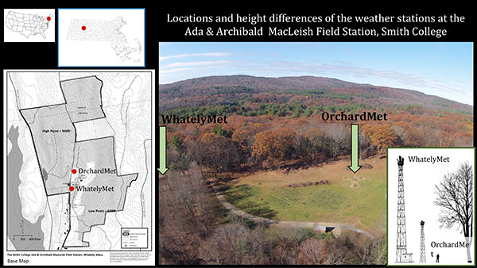

MacLeish
================

[](https://travis-ci.org/beanumber/macleish)

The Ada and Archibald MacLeish Field Station is a 260-acre patchwork of forest and farmland located in West Whately, MA that provides opportunities for faculty and students to pursue environmental research, outdoor education, and low-impact recreation. More information can be found at (<http://www.smith.edu/ceeds/macleish.php>)



This R package allows you to download and process weather data using the [ETL](http://www.github.com/beanumber/etl) framework from the MacLeish Field Station. It also contains shapefiles for contextualizing spatial information.

To install
----------

``` r
# install.packages("devtools")
devtools::install_github("beanumber/etl")
devtools::install_github("beanumber/macleish")
```

Use 2015 weather data
---------------------

Weather data from 2015 is available immediately from both the `Whately` and `Orchard` weather stations.

``` r
library(macleish)
glimpse(whately_2015)
```

    ## Observations: 52,560
    ## Variables: 9
    ## $ when         (time) 2015-01-01, 2015-01-01, 2015-01-01, 2015-01-01, ...
    ## $ Temp_C_Avg   (dbl) -9.32, -9.46, -9.44, -9.30, -9.32, -9.34, -9.30, ...
    ## $ WSpd_mps     (dbl) 1.399, 1.506, 1.620, 1.141, 1.223, 1.090, 1.168, ...
    ## $ Wdir_deg     (dbl) 225.4, 248.2, 258.3, 243.8, 238.4, 241.7, 242.3, ...
    ## $ RH_per_Avg   (dbl) 54.55, 55.38, 56.18, 56.41, 56.87, 57.25, 57.71, ...
    ## $ Press_mb_Avg (int) 985, 985, 985, 985, 984, 984, 984, 984, 984, 984,...
    ## $ SlrW_Avg     (dbl) 0, 0, 0, 0, 0, 0, 0, 0, 0, 0, 0, 0, 0, 0, 0, 0, 0...
    ## $ Rain_mm_Tot  (dbl) 0, 0, 0, 0, 0, 0, 0, 0, 0, 0, 0, 0, 0, 0, 0, 0, 0...
    ## $ temperature  (dbl) -9.32, -9.46, -9.44, -9.30, -9.32, -9.34, -9.30, ...

``` r
glimpse(orchard_2015)
```

    ## Observations: 52,552
    ## Variables: 10
    ## $ when         (time) 2015-01-01 00:00:00, 2015-01-01 00:10:00, 2015-0...
    ## $ Temp_C_Avg   (dbl) -9.990, -9.610, -9.700, -9.960, -9.820, -9.790, -...
    ## $ WSpd_mps     (dbl) 0.931, 1.014, 0.547, 0.727, 1.380, 0.965, 1.118, ...
    ## $ Wdir_deg     (dbl) 94.00, 105.00, 69.53, 95.90, 88.70, 90.80, 123.20...
    ## $ RH_per_Avg   (dbl) 67.76, 64.75, 65.32, 67.27, 66.09, 65.44, 66.06, ...
    ## $ Press_mb_Avg (dbl) 1016, 1016, 1016, 1016, 1016, 1016, 1016, 1016, 1...
    ## $ PAR_Den_Avg  (dbl) 0.548, 0.548, 0.548, 0.548, 0.548, 0.548, 0.548, ...
    ## $ PAR_Tot_Avg  (dbl) 0.088, 0.088, 0.088, 0.088, 0.088, 0.088, 0.088, ...
    ## $ Rain_mm_Tot  (dbl) 0, 0, 0, 0, 0, 0, 0, 0, 0, 0, 0, 0, 0, 0, 0, 0, 0...
    ## $ temperature  (dbl) -9.990, -9.610, -9.700, -9.960, -9.820, -9.790, -...

Live weather data
-----------------

Weather readings are logged every 10 minutes. Current and historical (dating back to 1/3/2012 for `whately` and 6/27/2014 for `orchard`) meteorological readings are available through the [ETL](http://www.github.com/beanumber/etl) framework. Please see the documentation for that package for more information about how this works.

``` r
macleish <- etl("macleish")
macleish %>%
  etl_update()
```

``` r
whately <- macleish %>%
  tbl("whately")
whately %>%
  mutate(the_year = strftime('%Y', when, 'unixepoch')) %>%
  group_by(the_year) %>%
  summarize(N = n(), begin = min(when), end = max(when), avg_temp = mean(temperature))
orchard <- macleish %>%
  tbl("orchard")
orchard %>%
  mutate(the_year = strftime('%Y', when, 'unixepoch')) %>%
  group_by(the_year) %>%
  summarize(N = n(), begin = min(when), end = max(when), avg_temp = mean(temperature))
```

``` r
daily <- whately %>%
  mutate(the_date = date(when, 'unixepoch')) %>%
  group_by(the_date) %>%
  summarize(N = n(), avgTemp = mean(temperature)) %>%
  collect()
library(ggplot2)
ggplot(data = daily, aes(x = as.Date(the_date), y = avgTemp)) +
  geom_point() + geom_smooth()
```

Maps
----

Spatial data is available through the `macleish_layers` data object.

``` r
class(macleish_layers)
```

    ## [1] "list"

``` r
names(macleish_layers)
```

    ##  [1] "landmarks"         "forests"           "streams"          
    ##  [4] "challenge_courses" "buildings"         "wetlands"         
    ##  [7] "slopes"            "boundary"          "research"         
    ## [10] "soil"              "trails"

``` r
library(leaflet)
leaflet() %>%
  addTiles() %>%
  addPolygons(data = macleish_layers[["boundary"]], 
              weight = 1, fillOpacity = 0.1) %>%
  addPolygons(data = macleish_layers[["buildings"]], 
              weight = 1, popup = ~ name) %>%
  addPolylines(data = macleish_layers[["trails"]], 
               weight = 1, color = "brown",
               popup = ~ name) %>%
  addPolylines(data = macleish_layers[["streams"]], 
               weight = 2) %>%
  addMarkers(data = subset(macleish_layers[["landmarks"]], grepl("Met", Label)), 
             popup = ~Label)
```
